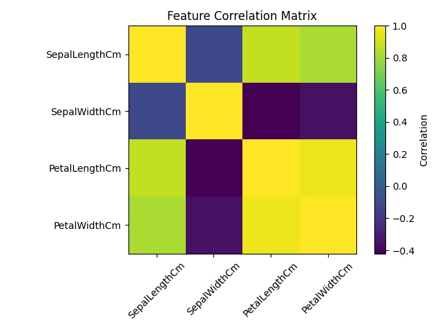
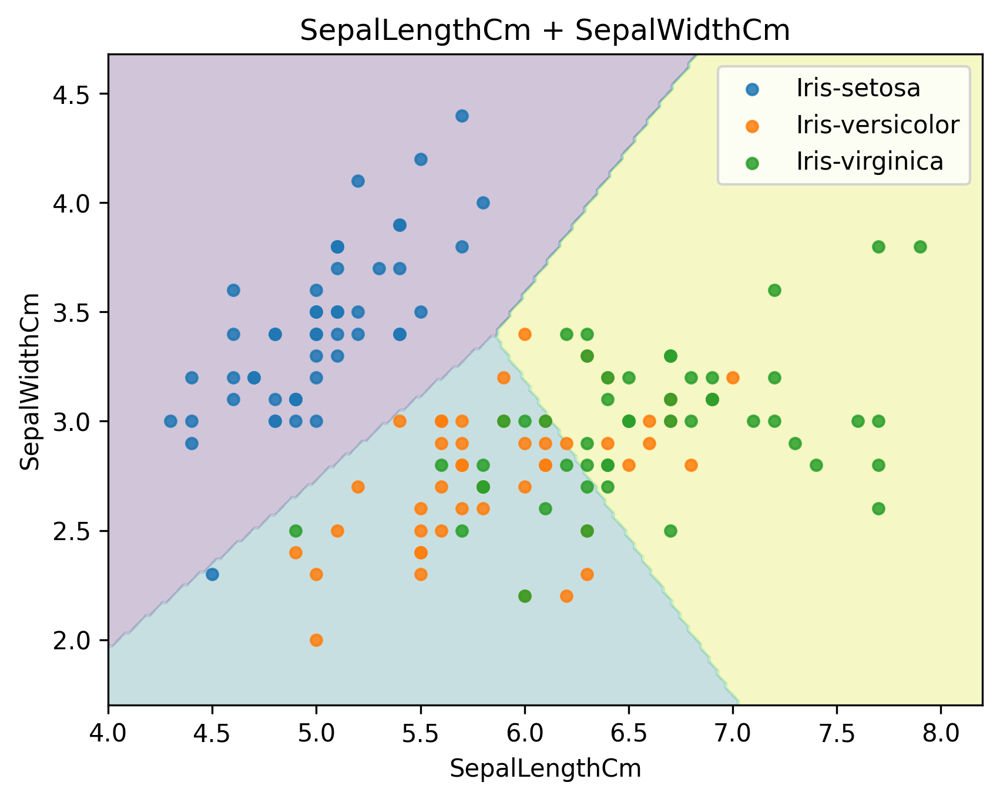
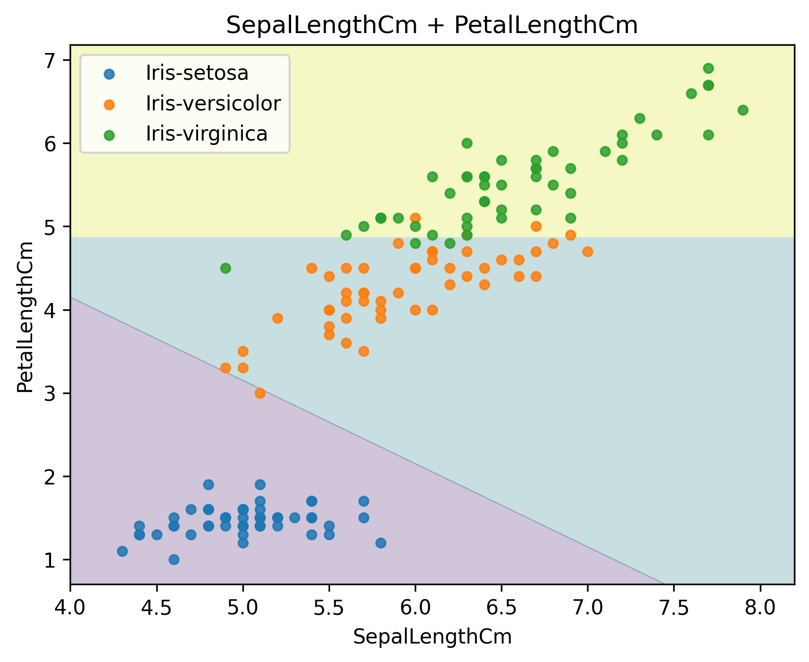
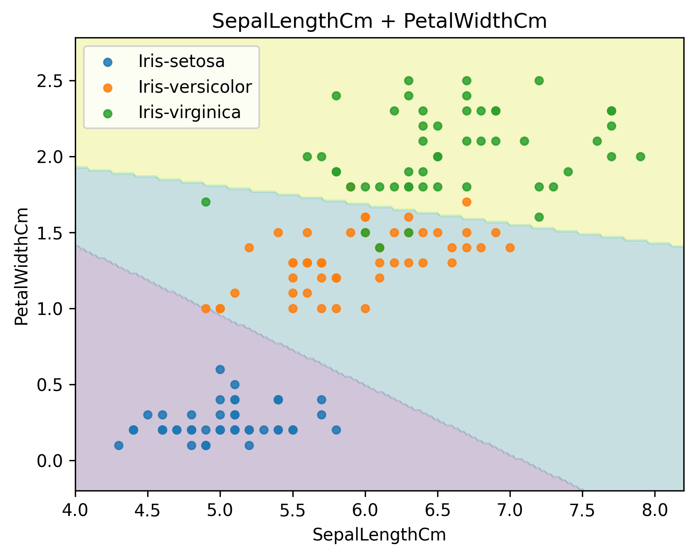
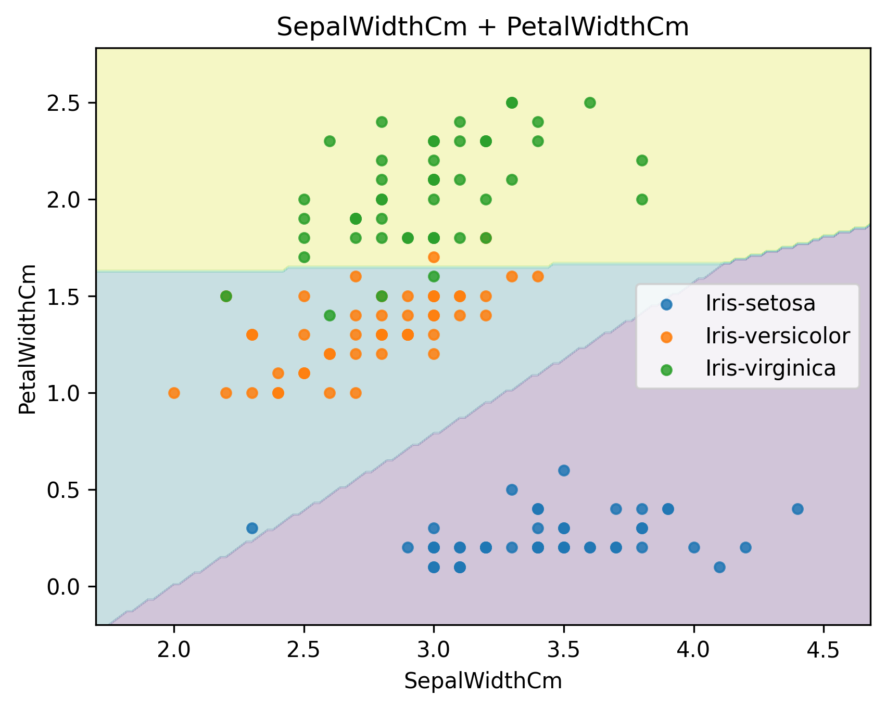
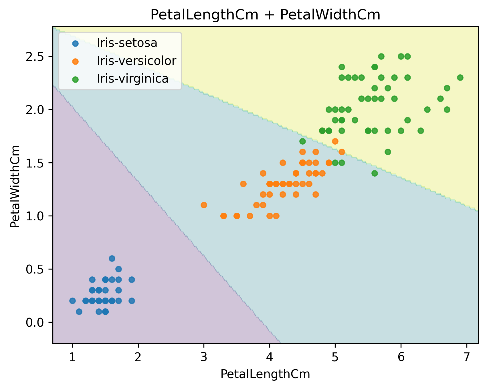

# Iris-classification

[English](#english) | [Русский](#русский)

---

## Русский

### Описание
Проект демонстрирует многоклассовую классификацию датасета **Iris** с помощью **Logistic Regression** из scikit-learn и визуализацию результатов:

- обучение модели на **всех 4 признаках** и вывод метрик (accuracy + confusion matrix);
- обучение отдельных моделей для **каждой пары признаков (2D)**;
- построение и сохранение **зон принятия решений** (decision regions) для каждой пары признаков;
- построение и сохранение **матрицы корреляций** признаков.

---

### Результаты

#### Матрица корреляций


#### Модель по всем признакам
**Accuracy:** 0.9333

**Confusion matrix:**
```text
[[10  0  0]
 [ 0  9  1]
 [ 0  1  9]]
```

#### Зоны принятия решений (пары признаков)
| Зоны | Accuracy + confusion matrix |
|---|---|
|  | **Accuracy:** 0.7333<br><br><b>Confusion matrix:</b><br><pre>[[10  0  0]&#10; [ 0  5  5]&#10; [ 0  3  7]]</pre> |
|  | **Accuracy:** 0.9333<br><br><b>Confusion matrix:</b><br><pre>[[10  0  0]&#10; [ 0  9  1]&#10; [ 0  1  9]]</pre> |
|  | **Accuracy:** 0.9000<br><br><b>Confusion matrix:</b><br><pre>[[10  0  0]&#10; [ 1  8  1]&#10; [ 0  1  9]]</pre> |
|  | **Accuracy:** 0.9333<br><br><b>Confusion matrix:</b><br><pre>[[10  0  0]&#10; [ 0  9  1]&#10; [ 0  1  9]]</pre> |
|  | **Accuracy:** 0.9333<br><br><b>Confusion matrix:</b><br><pre>[[10  0  0]&#10; [ 0  9  1]&#10; [ 0  1  9]]</pre> |
|  | **Accuracy:** 0.9333<br><br><b>Confusion matrix:</b><br><pre>[[10  0  0]&#10; [ 0  9  1]&#10; [ 0  1  9]]</pre> |

---

## English

### Description
This project demonstrates multiclass classification on the **Iris** dataset using **Logistic Regression** (scikit-learn) and visualizes the results:

- training a model on **all 4 features** and reporting metrics (accuracy + confusion matrix);
- training separate models for **each 2D feature pair**;
- generating and saving **decision regions** for each feature pair;
- generating and saving a **feature correlation matrix**.

---

### Results

#### Correlation matrix


#### Model trained on all features
**Accuracy:** 0.9333

**Confusion matrix:**
```text
[[10  0  0]
 [ 0  9  1]
 [ 0  1  9]]
```

#### Decision regions (feature pairs)
| Regions | Accuracy + confusion matrix |
|---|---|
|  | **Accuracy:** 0.7333<br><br><b>Confusion matrix:</b><br><pre>[[10  0  0]&#10; [ 0  5  5]&#10; [ 0  3  7]]</pre> |
|  | **Accuracy:** 0.9333<br><br><b>Confusion matrix:</b><br><pre>[[10  0  0]&#10; [ 0  9  1]&#10; [ 0  1  9]]</pre> |
|  | **Accuracy:** 0.9000<br><br><b>Confusion matrix:</b><br><pre>[[10  0  0]&#10; [ 1  8  1]&#10; [ 0  1  9]]</pre> |
|  | **Accuracy:** 0.9333<br><br><b>Confusion matrix:</b><br><pre>[[10  0  0]&#10; [ 0  9  1]&#10; [ 0  1  9]]</pre> |
|  | **Accuracy:** 0.9333<br><br><b>Confusion matrix:</b><br><pre>[[10  0  0]&#10; [ 0  9  1]&#10; [ 0  1  9]]</pre> |
|  | **Accuracy:** 0.9333<br><br><b>Confusion matrix:</b><br><pre>[[10  0  0]&#10; [ 0  9  1]&#10; [ 0  1  9]]</pre> |
